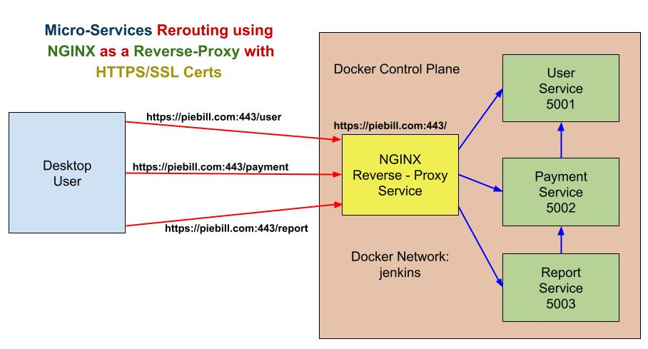
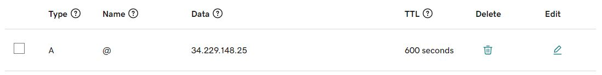
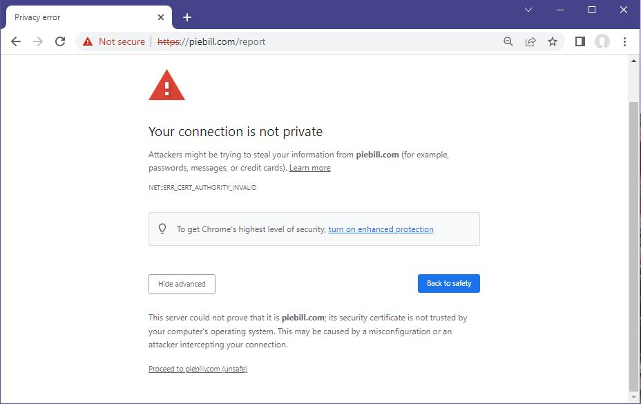
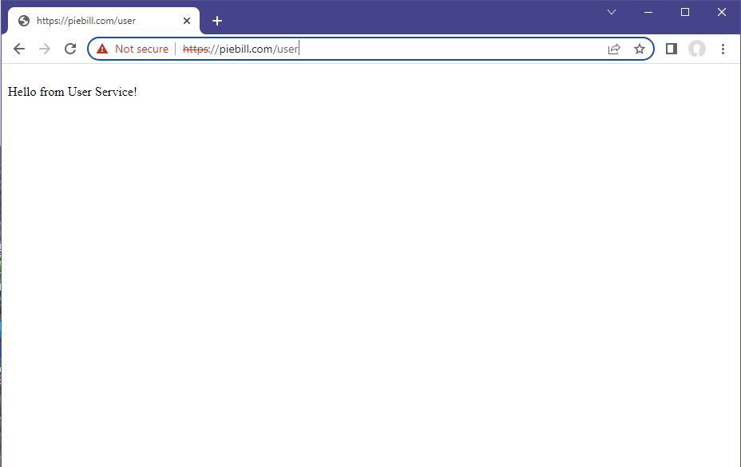
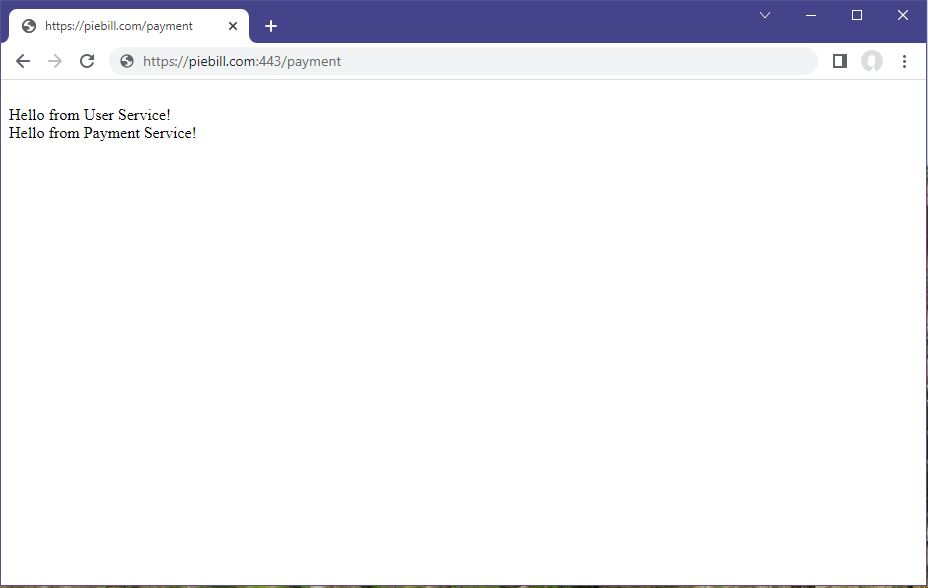

# Micro-Services with NGINX Reverse-Proxy, HTTPS/SSL Certs in Docker
---


#### Below is a diagram shown or how Micro-Services Architecture using NGINX Reverse-Proxy is designed:



#### 1. Create t2.medium, Ubuntu 22.04 AWS EC2 Instance and Allow 80, 443 in Security Groups Inbound Traffic Rules

#### 2. Run below command to install docker and "docker compose" software:
```
chmod 755 ec2software.sh
./ec2software.sh
```

#### 3. To install the Pre-Requisite Software for the Micro-Services:
```
sudo apt update
sudo apt install net-tools
sudo apt install pip
sudo apt install make
pip install -r payment/requirements.txt
open new putty/bash shell so .profile gets called in.
```

#### 4. open new putty/bash shell so .profile gets called in.

#### 5. Run git clone to get source code from github
```
git clone https://github.com/wrkbase/microsvc-nginx-docker.git
```

#### 6. Updating DNS Entries in your Hosting Provider CPanel



#### 7. update with yourdomain.com in nginx/default.conf according the DNS Entries in your Hosting Provider CPanel
```
Update and replace all piebill.com with yourdomain.com
```

#### 8. Starting up the Micro-Services:
```
cd microsvc-nginx-docker
make start-docker
```

#### 9. Run below command to get the IP Address of EC2:
```
wget -qO- http://instance-data/latest/meta-data/public-ipv4; echo
```
#### 10. Open below URLs in a browser:
```
http://ip-address:443/user
http://ip-address:443/payment 
http://ip-address:443/report 
```

#### Diagram showing SSL Certificate Trust Screen:


#### Diagram showing User API:


#### Diagram showing Payment API:


#### Diagram showing Report API:


#### 8. Stopping and Removing all Micro-Servcies work data:
```
make clean-all
```

#### 9. Testing the working of all Micro-Servcies Website URLS:
```
make test-docker
```


---
### Notes :
---

#### .netrc for git pushing
```
$ cat ~/.netrc
machine github.com
        login wrkbase
        password GHPkgBDssFYHaILmDgcUj6saq8zvYKF2LpHc4
```
#### To view git modifications status
```
git status
```

#### To view git pushed status to origin
```
git log --name-status
```

#### To push to git repo
```
git add . && git commit -m "Updating latest docs and code" && git push origin
```

#### To revert to previous commit state
```
git reset --hard HEAD~1
git log --name-status
git push -f -u origin
OR
git push -f -u origin main
```


**Setting up bash script for alias commands** 

ubuntu:~$ cat shcut.sh

```
alias cls='clear'
alias scn='screen'
alias gitusr='git config --global user.name "Srikanth Pen"'
alias giteml='git config --global user.email "wrkbase@gmail.com"'
alias gitlst='git config --list --global'
alias gtcl='git clone https://bitbucket.org/wrkbase/dockertraefikselfsign.git --branch master'
alias frgrp='for i in `find src -name "*.js"`; do echo $i ===========================; grep "createUser" $i; done'
alias frdif='for i in `find . -name "*.ORG"`; do echo $i =====================================; fl=`echo $i | sed 's/.ORG$//'`; diff --color $i $fl; done'
alias diffc='diff --color'
alias gits='git status'
alias gitns='git log --name-status'
alias gitdc='git log --graph --all --decorate --pretty="%Cred%h%Creset -%C(auto)%d%Creset %s %Cgreen(%ad) %C(bold blue)<%an>%Creset" --date=short'
alias gitcomm='git status; git checkout -b master; git add . ; git commit -m "Traefik HTTPS Trusted Web Secure Certificates in Docker"; git push -u origin master; git status;'
alias gitfrc='git push -f -u origin master'
```

---
